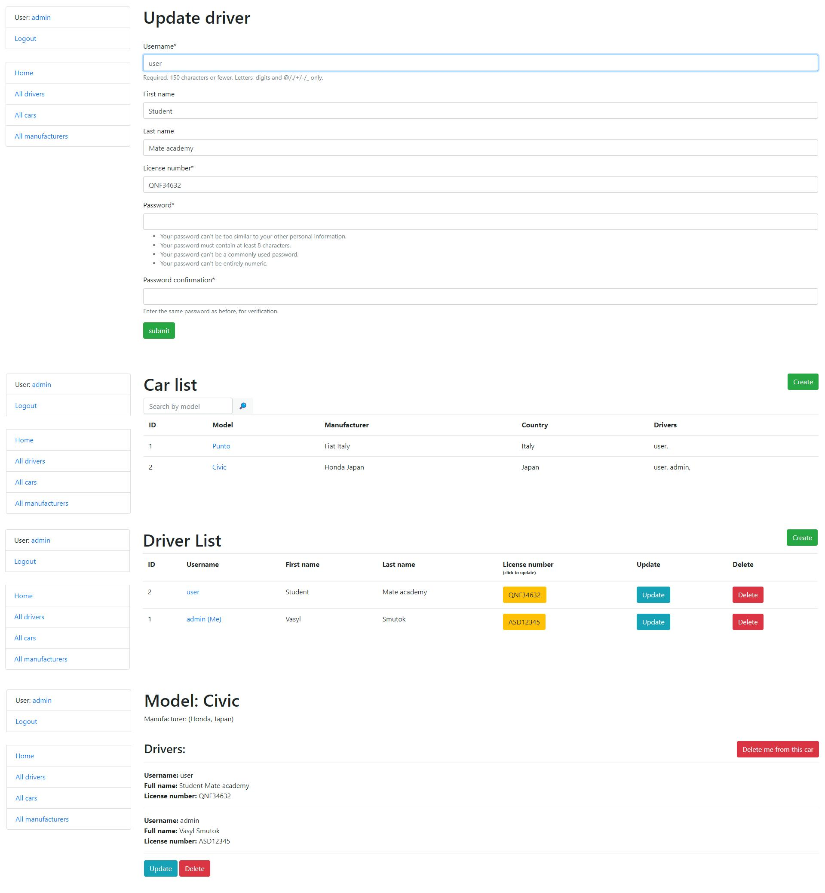

# taxi-service

Django project for managing cars and drivers in Taxi Service

## Check it out!


[Taxi service deployed to Heroku](https://taxi-service-smutok.herokuapp.com)

#### test user so that you can check the functionality of the site:
```shell
login: user
password: user12345
```


## Installation

Python3 must be already installed

```shell
git clone https://github.com/Vasyl-Smutok/taxi-service.git
cd taxi_service
python3 -m venv venv
source venv/bin/activate  # on macOS
venv\Scripts\activate  # on Windows 
pip install -r requirements.txt  
python manage.py migrate 
python manage.py createsuperuser # create your super user
python manage.py runserver # start Django Server
```


## Features 

* Authentication  functionality fot Driver/User
* Managing cars drivers & manufactures directly from website
* Pover full admin panel fro advance managing

## Demo 

